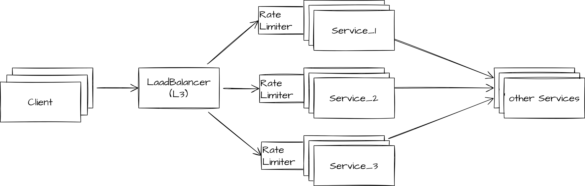

###Функциональные требование
+ Балансировка нагрузки на сервис назначения(target service) с целью защиты от DDoS-атак

###Нефункциональные требования
+ Высокая доступность(availability)
+ Высокая надежность (reliability)

Работа распределенного лимитера должна быть суперэффективной, потому что механизм будет вызываться при каждом запросе, тем самым он добавляет дополнительные накладные расходы на обработку запроса. Дизайн должен обеспечить минимальное время отклика и возможность расширения системы.

###Общие проблемы при работе с Rate Limiter

####Дано

С клиента летит запрос на LoadBalancer, даже идет распределение на другие сервисы.

___Первое решение:___ Поставить RateLimiter прям на balancer’e
 

Недостатки:

Балансировка не разбирается в какой именно сервис летит запрос => понимает трафик, с которым чисто теоретически могли бы справиться сервисы после Balancer’а

___Второе решение:___ RateLimiter на каждый сервис по отдельности(и на каждый его экземпляр(instance), которые независимы друг от друга)

 
 
Недостаток:

При поломке одного из инстансов, то общий Ratelimit уменьшится(если экземпляров было 3, то уменьшится на треть), хотя, возможно, остальные экземпляры и справятся с этой нагрузкой.

Решение: при поломке одного из экземпляров поменять limit’ы для оставшихся rateLimiter’ов. 

Недостаток: (я не так силен в k8s и os) кажется, что придется каждый раз перераскатывать deployment, а это простой

###Конечная архитектура Rate Limiter
	
####Компоненты:
+ Сервис принятия решений
+ Хранилище состояний и конфигураций

####Подход к распределенному лимитеру:
+ В каждый под делаем инъекцию sidecar-прокси, через который проходит трафик в сервис/из сервиса пода
+ Каждый под содержит в себе механизм принятия решения на пропуск запроса или его отброс
+ Каждый sidecar прокси при выполнение механизма принятия решения обращается к сервису-лимитеру для получения текущей статистике по окну
+ На основание статистики прокси пропускает запрос или блокирует его

####Хранилище состояний
Хранилище состояний должен эффективно хранить и обрабатывать большое количество ключ-значений.
	
Наиболее частые операции:

+ Регистрация значения по ключу
+ Изменение значения по ключу
+ Декремент значения на основе timestamp

Для эффективного соблюдения вышеперечисленных условий выбор делаем в сторону Redis. При том его падение и перезапуск для нас не представляет большой проблемы.

####Алгоритм прокси-лимитера
1. Получение запроса
2. Вычислить ключ от запроса
3. Обратиться к мастер-лимитеру синхронным запросом на получение разрешения на пропуск запроса. Ждать ответа не более двух секунд
4. Если ответа от мастер-лимитера не последовало - пропустить запрос к сервису
5. Если мастер-лимитер отвечает отказом - отбросить запрос
6. Если мастер-лимитер отвечает положительно - пропустить запрос к сервису

####Алгоритм мастер-лимитера
1. Получени от прокси-лимитера запроса на разрешение на пропуск по данному ключу
2. По данному ключу получить значение из хранилища запросов
3. Отбросит устаревшие timestamp и на основе количества отброшенных понизить текущее значение запросов в окне по текущему ключу
4. Если запросов больше или равно лимиту - ответить отказом прокси-лимитеру
5. Если запросов меньше лимта - добавить текущий timestamp к текущему ключу и увеличить его счетчик запросов в окне
